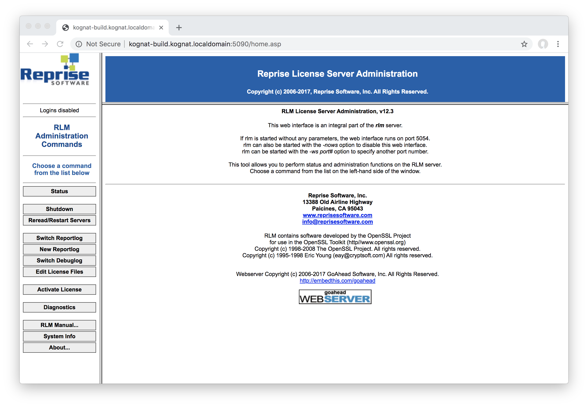

.. _licensing:

*********
Licensing
*********

Kognat makes use of industry standard licensing system, Reprise License Manager (RLM) for your convience.

This software allows for reliable and fair license tokens that can be used for both Node Locked and Floating License arrangements.

A single license allows multiple computations on a single machine with the license checked out.

A Node Locked license may only be used on the single machine for which the license has been signed.

Floating licenses may be used by one host per license but allows for that host to compute a number of Rotobot nodes concurrently.

The more licenses purchased the more machines that can participate in computation concurrently, to make the scaling of cost linear.

Getting familiar with the entire Reprise License Management System may be of benefit to you if you are in the business of administering licenses, and a current link to a Portable Document Format file of the Administrator's guide can be found here:

http://www.reprisesoftware.com/RLM_License_Administration.pdf

Currently Kognat is supporting the following version the RLM software

::

   v12.3 BL3

The independant software vendor (ISV) string is 

::

    kognat

Meaning that the environment variable in question is

::

   kognat_LICENSE

(Note the letter S in LICENSE)

There are two use cases for setting this environment variable

Node locked license with a license file
==========================================

If you purchase a node locked license, there is no need to run the license server.

It is the systems administrator's responsibility to set the following Environment Variable

This may be assisted by an installer binary or script on your operating system

::

    kognat_LICENSE

The Environment Variable's value will be set to the location of the license file

for instance

::

    C:\Program Files\Kognat\kognat.lic

This license will be signed to your own computer's identifier and is not transferable.

Floating license with a server executable using license file and the clients pointing to server
==================================================================================================

If you purchase a floating license, you will need to host an RLM executable on an accessible server.

The clients to this server will know of its location on the network via a unique qualified domain name or internet protocol numeric address.

In addition the port number of the server will also need to be set on the server and subscribed to by the client.

Server
^^^^^^

On the server at the minimum the following are required

#. An RLM executable for the operating system of the server
#. The Kognat .set file for the public key
#. A valid license file, keyed to your server's identifier and it not transferable

Executing the RLM binary will host a service on your network that your client's can subscribe to this service by way of the environment variable detailed below 

Client
^^^^^^ 

Client Environment variable name

::

   kognat_LICENSE

Client variable value template

::

   <port>@<host_UQDN_or_IP>

For example

::

    2102@kognat-lic.company.domain

Requesting a trial license
==========================

Kognat is happy to provide a time limited trial for indviduals, companies and other institutions.

The trial license will remove the watermark which can be distracting while asessing if Rotobot OpenFX Plugin from Kognat meets your requiremnts.

To prevent from users from exploting an automated system, we ask that all trials arrangements take place either by the contact form or via email.

This also allows Kognat staff to get feedback which will allow the product to better meet your use case.

The contact form can be found here:

https://kognat.com/contact/

How to find a hostid to sign a trial license
^^^^^^^^^^^^^^^^^^^^^^^^^^^^^^^^^^^^^^^^^^^^

On the installation of the free download, current versions will include an exectable which is the Reprise License Management Utility Tool

Windows
::

   C:\Program Files\Kognat\licensing\rlmutil.exe

macOS
::

   /Applications/Kognat/licensing/rlmutil

Linux
::

   /opt/Kognat/licensing/rlmutil

This software is a command line application, which seems like an ancient way of interfacing with a computer, but it works well.

To run the command line interface from your operating System follow the guides below

How to find your rlmhostid on Windows:
^^^^^^^^^^^^^^^^^^^^^^^^^^^^^^^^^^^^^^ 

1. Press Windows+X to open the Power Users menu, and then click “Command Prompt” or “Command Prompt (Admin).”
2. Type the following command

::

    cd "C:\Program Files\Kognat\licensing"

3. Hit enter
4. Type the following command

::

    rlmutil rlmhostid -q ether

5. Hit enter
6. The output of this command can be copied by highlighting and hitting Ctrl-C and then Ctrl-V into an email for Kognat Staff, eg:

::

    C:\Program Files\Kognat\licensing>rlmutil rlmhostid -q ether
    90b11ce77d93 005056c00099 005056c07208

How to find your rlmhostid on macOS:
^^^^^^^^^^^^^^^^^^^^^^^^^^^^^^^^^^^^

1. Open the Spotlight magnifying glass icon on the top left of your computer
2. Type "Terminal" into the Spotlight Search text field
3. Terminal Application will launch
4. Type the following command into the Terminal window to change directories

::

    cd /Application/Kognat/licensing/

5. Hit enter
6. type the following command

::

    ./rlmutil rlmhostid -q ether

7. Hit enter
8. The result should be someting with one of more numbers

::

    macname:licensing$ ./rlmutil rlmhostid -q ether
    90b11ce77d93 005056c00099 005056c07208

9. With your mouse highlight the text in the Terminal window and hit Command-C to copy and Command-V to paste into an email for Kognat Staff

How to find your rlmhostid on Linux:
^^^^^^^^^^^^^^^^^^^^^^^^^^^^^^^^^^^^

1. Right click on your desktop to open a command line interface "Open in Command Prompt..."
2. Command Line Application will launch
3. Type the following command into the Terminal window to change directories

::

    cd /opt/Kognat/licensing/

4. Hit enter
5. type the following command

::

    ./rlmutil rlmhostid -q ether

6. Hit enter
7. The result should be someting with one of more numbers

::

    linuxname$ ./rlmutil rlmhostid -q ether
    90b11ce77d93

8. With your mouse highlight the text in the Terminal window and hit Ctrl-Shift-C to copy and Command-V to paste into an email for Kognat Staff

Node Locked license installation
================================

Installing a node locked license is simple there are three parts

1. Store the license file on disk
2. Create a new environment variable ``kognat_LICENSE`` which has a value of the above disk location
3. Test the environmemnt variable is used in you composting package

It is possible Kognat Staff will provide you with an automated way of installing the license, so you will just need to test the license is working correctly after using the installer or installer script.

Installing a node locked license on Windows manually
^^^^^^^^^^^^^^^^^^^^^^^^^^^^^^^^^^^^^^^^^^^^^^^^^^^^

1. Download the the .zip archive containing the .lic file from email
2. Copy with Administration permissions the .lic file to the following location

::

  C:\Program Files\Kognat\kognat.lic

3. Open the Program "Add / Remove Environment Variables"
4. Click the button "Add"
5. Type the name for the new environment variable as follows

::

   kognat_LICENSE

6. Once the environment variable is created set its value by "Browse for file"
7. The location will be where you saved the .lic file earlier 

::

   C:\Program Files\Kognat\kognat.lic

8. Close your compositing package which has the watermarked image
9. Open the compositing package, clear all caches
10. The watermark should be removed if the license is valid
11. If the watermark is not removed, double check your steps and contact Kognat staff

Installing a node locked license on macOS
^^^^^^^^^^^^^^^^^^^^^^^^^^^^^^^^^^^^^^^^^

1. Follow the download instructions from Kognat staff
2. The installer will include an executable .command file which will automate the install for you
3. Some anti virus software will give warnings about the script's contents in the section below you can do the steps by hand if you prefer
4. Expand the .zip archive
5. Double click the ``kognat.command`` file contained within
6. Repeat for each user that wishes to use the software

Below we explain the action of the ``kognat.command``

below is the contents of one such file

::

	#!/usr/bin/env bash
	echo "Installing Kognat License"

	echo ' 
	  
	 
	LICENSE kognat rotobotsegmentation 20.0 2020-03-05 uncounted
	  hostid=003ee1c31ba9 platforms="x64_m x64_l x64_w" _ck=41274f2afb
	  sig="60P0452E90CPXMRK3HN10VYTMFP8T9KSWJSG2A022GY5NRY60HRW7UXSHCENDM1
	  CD7TY7XPA4V"
	LICENSE kognat rotobotinstancesegmentation 20.0 2020-03-05 uncounted
	  hostid=003ee1c31ba9 platforms="x64_m x64_l x64_w" _ck=96274fce3a
	  sig="60PG451QF9NBFFESGDUU3AVY2EVCUE26CH087DR22M0D2QVAUJPYSK7C49BEHXB
	  DWG843K74024G"
	LICENSE kognat rotobottrimap 20.0 2020-03-05 uncounted
	  hostid=003ee1c31ba9 platforms="x64_m x64_l x64_w" _ck=c0274f8705
	  sig="60Q04580Q7VT4BW9BF4V8NMASFF30Q2PCE5X2W8708AG1NG31AJA3SQHA82GPXG
	  H79MBE2DCCXB3T"

	'>~/kognat.lic
	mkdir -p ${HOME}/Library/LaunchAgents 2> /dev/null

	rm ${HOME}/Library/LauchAgents/kognat.plist 2> /dev/null

	echo '<?xml version="1.0" encoding="UTF-8"?>

	<!DOCTYPE plist PUBLIC "-//Apple//DTD PLIST 1.0//EN" "http://www.apple.com/DTDs/PropertyList-1.0.dtd">

	<plist version="1.0">
	<dict>
	 <key>Label</key>
	 <string>kognat.startup</string>
	 <key>ProgramArguments</key>
	 <array>
	 <string>sh</string>
	 <string>-c</string>
	 <string>launchctl setenv kognat_LICENSE ${HOME}/kognat.lic</string>

	 </array>
	 <key>RunAtLoad</key>
	 <true/>
	</dict>
	</plist>' > ${HOME}/Library/LaunchAgents/kognat.plist

	launchctl start ~/Library/LaunchAgents/kognat.plist 2> /dev/null
	launchctl load ~/Library/LaunchAgents/kognat.plist 2> /dev/null
	launchctl start ~/Library/LaunchAgents/kognat.plist 2> /dev/null
	launchctl stop ~/Library/LaunchAgents/kognat.plist 2> /dev/null
	launchctl unload ~/Library/LaunchAgents/kognat.plist 2> /dev/null
	launchctl load ~/Library/LaunchAgents/kognat.plist 2> /dev/null
	launchctl start ~/Library/LaunchAgents/kognat.plist 2> /dev/null

	echo "Kognat License installed"
	echo "Added file ${HOME}/kognat.lic"
	echo "Added file ${HOME}/Library/LaunchAgents/kognat.plist"
	echo "Kognat OpenFX Plugin now setup for for ${USER}"
	cat ${HOME}/kognat.lic

So what does it do?

1. Create a file called ``kognat.lic`` in the users home directory with the license information
2. Creates this folder  ``$HOME/Library/LaunchAgents`` and if it doesn't exist
3. Creates a file called ``kognat.plist`` in the users ``$HOME/Library/LaunchAgents``
4. The ``kognat.plist`` file is run when a program loads
5. The environment variable ``kognat_LICENSE`` is set to ``$HOME/kognat.lic`` by ``$HOME/Library/LaunchAgents/kognat.plist`` when a program launches
6. running a number of launchctl commands ensurve the service created by the ``kognat.plist`` file are up to date

You are welcome to find another way to ensure that 

1. ``kognat_LICENSE`` is set and has the value of the folder and filename of ``kognat.lic``
2. ``kognat.lic`` contains a valid locatiopn on disk ideally ``$HOME/kognat.lic``
3. ``kognat.lic`` contains a valid RLM node locked license
4. This is all done in the runtime environment where the macOS program that is using the OpenFX Plugin

Installing a node locked license on Linux
^^^^^^^^^^^^^^^^^^^^^^^^^^^^^^^^^^^^^^^^^

1. Download the .zip archive as instructed by Kognat staff
2. Run the installer with super user permissions where <installerfolder> is the name of the extracted installer

::

   sudo ~/Downloads/<installerfolder>/*.sh

3. Follow the GUI
4. Run your application to check the install is working
5. Reboot if needed

What does the Linux installer do?

1. Copies a license to ``/opt/Kognat/kognat.lic``
2. Adds two files to ``/etc/profile.d``
3. The files are as follows

::

   /etc/profile.d/kognat.csh
   /etc/profile.d/kognat.sh

4. The contents of the files simply set the environment variable ``kognat_LICENSE`` to ``/opt/Kognat/kognat.lic``

::

  $linux> cat /etc/profile.d/kognat.csh
  #!/usr/bin/env csh
  setenv kognat_LICENSE /opt/Kognat/kognat.lic

::

  $linux> cat /etc/profile.d/kognat.sh
  #!/usr/bin/env sh
  export kognat_LICENSE=/opt/Kognat/kognat.lic

Floating license installation
=============================

There are two parts to a floating license system

1. RLM Server running of the License Server Host
2. Environment variable set on the client to find the RLM server

The RLM Server is a command line service, but is accessible via a Web based GUI and log file.

It needs a ``kognat.set`` file and a ``.lic`` text license file and the ``rlm`` executable

Clients can be configured in a similar way to node locked license, but rather than pointing to a file, they point to a port and host on the network.

Clients can see the server via ``kognat_LICENSE`` set to ``<port>@<hostname.domain>``

Where the server is running on TCP port ``<port>`` on a machine with unique qualified domain name UQDN of ``<hostname.domain>`` for example ``2102@licenses.kognat.localdomain``

The port is determined in the license and can be adjusted without breaking the encyption. 

Running the License Server
^^^^^^^^^^^^^^^^^^^^^^^^^^

The rlm command is:

::

   % rlm [-c license_file] [-dlog [+]logfile]
      [-nows] [-ws port] [-x [rlmdown|rlmremove]]
      [-install_service] [-service_name sname]
      [-isv_startup_delay seconds]

The ``-c license_file`` option specifies which license file to use. This option overrides the setting of the ``RLM_LICENSE`` environment variable. The ``license_file`` parameter can be a directory containing license files, all of which will be processed.

The ``-dlog logfile`` specifies the pathname for the server debug log. If logfile is preceded by the ``+`` character, the logfile will be appended, otherwise it is overwritten.

The ``-nows`` and ``-ws`` port options control the operation of the embedded Web Server. The ``-nows`` option instructs the rlm server to not start the embedded web server. The ``-ws port`` option instructs the rlm server to use port as the port number for the web server.

The ``-x [rlmdown | rlmremove]`` option controls whether the rlmdown and/or rlmremove commands will be processed by the server. Specifying only ``-x`` will disable both commands. Specifying either command name after the ``-x`` will disable just that command.

These options can appear in any order on the command line.

Note that if the rlm server cannot bind the web server port (``5054`` by default), it will exit.

Installing a RLM service on Windows
^^^^^^^^^^^^^^^^^^^^^^^^^^^^^^^^^^^

Download the Windows License Server Software:

https://bit.ly/windows-rlm-kognat-12-3 

Running the RLM Server as a Service on Windows

On Microsoft Windows servers, you may want to install and run the rlm server as a Windows service process. A service process can start automatically at boot time and remain running as long as the system is up, regardless of user logins and logouts.

You can install RLM as a service either in the RLM web interface or in a command window. Once installed as a service, it remains installed until it is explicitly deleted as a service. Installing RLM as a service does not start RLM; services are started via the Windows Services control panel, and at boot time.

To install using the web interface, select Manage Windows Service from the main menu on the left. You will get a form with 3 data fields:

:: 

   service name

:: 

   logfile name

::

    optional command-line arguments

All 3 fields will be filled in with default values. You can just select “Install Service”, and the “rlm” service will be installed for you. By default, the logfile is put in the directory with the rlm.exe binary, and it is named rlm.log. Also, by default, rlm will search for all license files in this directory.

If you select Remove Service, the service name specified in the form will be removed.

Note

If the instance of rlm which you are running is actually running as a service, you will not be able to Remove the Service (since it is running). To remove the service, you will have to stop the service, and then either use the service control panel in Windows, or run rlm in a command window and use the Remove Service option in the web interface.*

Optionally, you can install RLM as a service in a command window. To do this, use the rlm program itself (in a command window), with special arguments:

::

   rlm -install_service -dlog [+]logfile [-service_name sname] <rlm runtime args>

where: logfile is the pathname for the server debug log. This parameter is required. If preceded by the ‘+’ character, the logfile will be appended, rather than created.

sname is an optional name for the installed service. If not specified, sname defaults to “rlm”. If sname contains embedded whitespace, it must be enclosed in double quotes.

``<rlm runtime args>`` are any other command line arguments to be passed to rlm when it is started. Example:

::

    rlm -install_service -service_name rlm-xyz -dlog c:\logs\server.log -c c:\licenses\xyz.lic

This installs rlm as a service under the name “rlm-xyz”. When started via the Services control panel or at boot time, rlm will be passed the “-c c:licensesxyz.lic” args, and it will write it’s debuglog information to the file c:logsserver.log

Installed RLM services are also deleted with the rlm program. Services must be stopped via the service control panel before they can be deleted. Note that deleting a service deletes it from the Windows service database; it does not delete the rlm executable or associated license file(s):

::

    rlm -delete_service [-service_name sname]

where: sname is an optional name for the installed service. If not specified, service_name defaults to “rlm”. If service_name contains embedded whitespace, it must be enclosed in double quotes.

Running the RLM Server as a Service on Linux
^^^^^^^^^^^^^^^^^^^^^^^^^^^^^^^^^^^^^^^^^^^^
Download the RLM executatble for Linux

https://bit.ly/linux-rlm-kognat-12-3

On most Unix systems, system services are started at boot time, usually via startup scripts located in /etc/rc.<something>. For example, the script could be located in /etc/init.d/rlm, with a link to /etc/rc5.d/S98rlm. Note that you must install this startup script as root.

The startup script should su to a different user so that the rlm servers are not running as root.

Running the RLM Server as a Service on macOS
^^^^^^^^^^^^^^^^^^^^^^^^^^^^^^^^^^^^^^^^^^^^

Download the RLM for macOS

https://bit.ly/mac-osx-rlm-kognat-12-3

On Mac systems, the server can be started by placing a script in ``/Library/LaunchDaemons`` .

The following is an example of a script which would start rlm at boot time on Mac systems. Note that this script must be placed in the ``/Library/LaunchDaemons`` directory, and it must have an extension of .plist.

You should change ABSOLUTE_PATH_TO_RLM to the path to the rlm server binary. You can add additional ProgramArguments as needed:

::

    <?xml version="1.0" encoding="UTF-8"?>
    <!DOCTYPE plist PUBLIC "-//Apple//DTD PLIST 1.0//EN" "http://www.apple.com/DTDs/PropertyList-1.0.dtd">
    <plist version="1.0">
    <dict>
           <key>Label</key>
           <string>com.kognat-licensing.rlm</string>
           <key>ProgramArguments</key>
           <array>
           <string>ABSOLUTE_PATH_TO_RLM</string>
           </array>
           <key>RunAtLoad</key>
           <true/>
    </dict>
    </plist>

RLM web server
==============

As instructed by the ``-ws port_number`` directive you can access the Reprise Web GUI from any browser to the pattern as follows

::

   http://<host_or_UQDN>:<port_number>

As seen below with ``kognat-build.kognat.localdomain`` as an example hostname and ``5090`` as the port number

Annual License renewal
====================== 

Licenses are not automatically renewed at this stage in time.

You will need to purchase again from the Kognat store, a reminder may be sent.